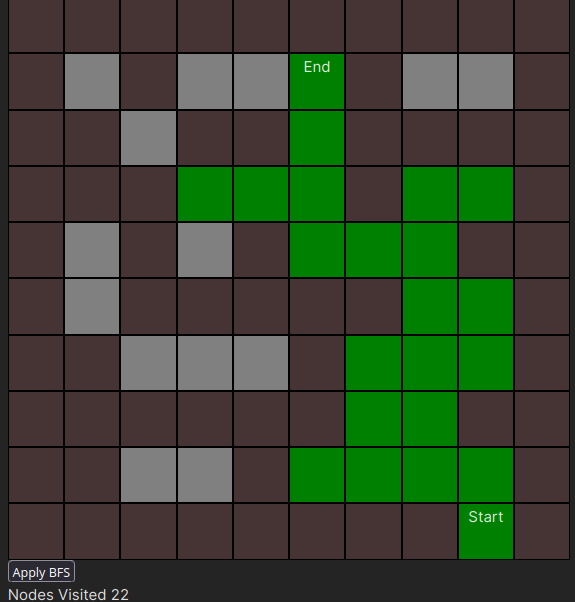

It's a 10x10 grid with walls of some brownish color, and open paths of grey color, traverse paths are marked as green.

What I have learnt is :
- Expand my knowledge of traversing iterables in JS.
- Converting 2D indices to 1D, and 1D to 2D.
- New ways for visualizing algorithms.

Next I am going to implement : 
- DFS, A*, Dijks.t.ra, and other search algorithms like that in the same project
- Custom user input for grid size, and custom grids via file upload as I have used '#' and ' ' to denote empty and blocked paths.

